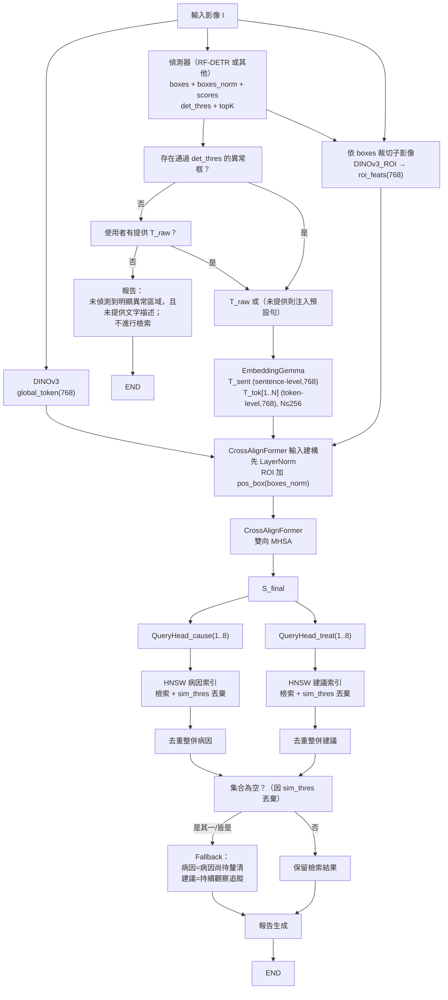
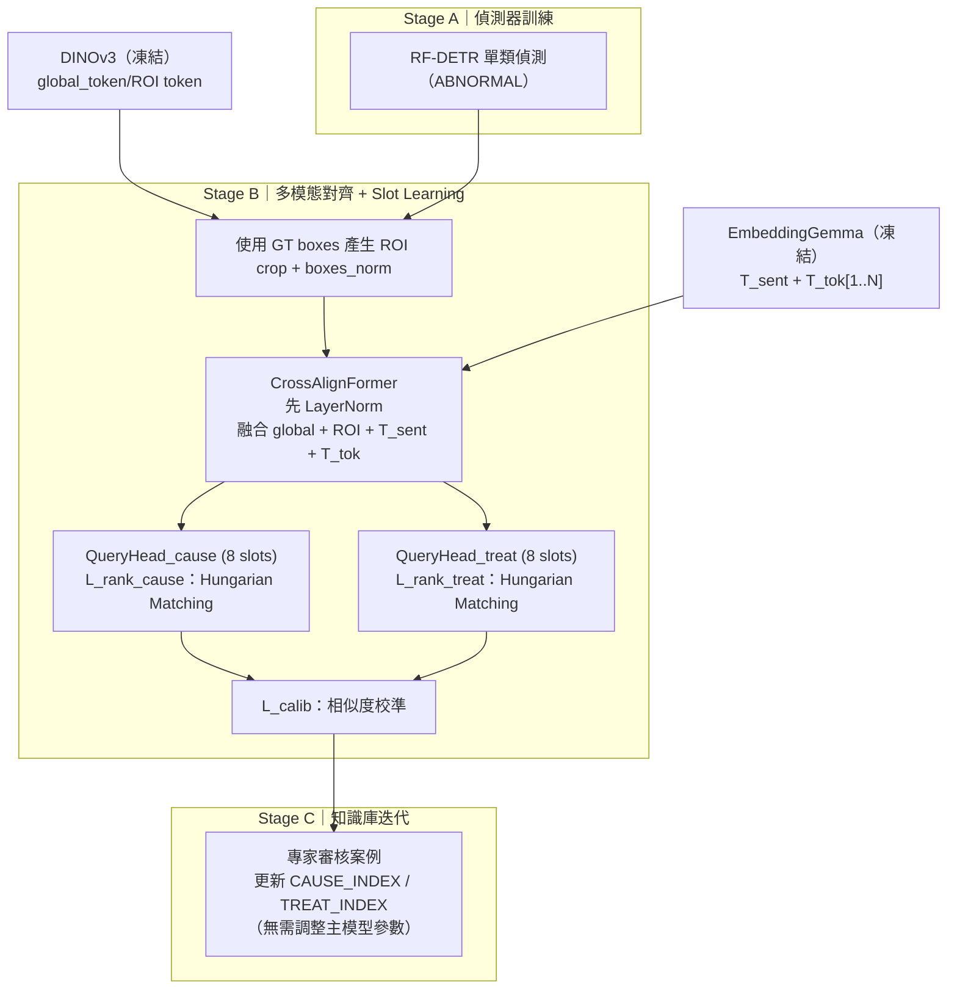

# 目標與輸出

## 輸入

* 單張魚體相關影像（可能是整隻魚或局部特寫）
* 使用者文字描述 `T_raw`（可選）

### 文字注入規則

* **若推論流程需要文字語意（例如：存在病灶框、要進入 CrossAlignFormer 多模態路徑）但使用者未提供 `T_raw`**，系統注入預設文本：
  「魚體外觀異常，似乎生病了。」
  → 確保多模態路徑仍能取得文字語意訊息
* **若「未偵測到框」且「未提供 `T_raw`」**：走「健康路徑（不進行檢索）」；不注入預設句（見推論路徑）。

---

## 中介表示

* 影像全域特徵（Vision Backbone：DINOv3，全域 token）
* 病灶偵測框（Object Detection：RF-DETR，單類別，輸出每個框的座標與分數）
* ROI 視覺特徵（DINOv3：以偵測框在原圖上裁切出子影像，分別送入 DINOv3 取得每個 ROI 的特徵）
* 文字語意表示（Text Encoder：EmbeddingGemma）

  * **sentence-level**：`T_sent ∈ ℝ^768`（單一向量）
  * **token-level**：`T_tok[1..N]`（每個 token 一個 768 維向量；由 embedding table lookup 得到；`max_text_len=256`）

---

## 核心匯流

* CrossAlignFormer 多模態對齊模組（以下簡稱 **CrossAlignFormer**）

---

## 輸出

1. 病灶偵測結果

* 框的座標（原圖像素座標）
* 偵測分數（0–1 置信分數）

2. 病徵原因（集合）

* 由模型產生之病因槽位向量檢索知識庫後，整併得到的病因候選清單
* 每項附相似度分數
* 若多個槽位檢索到同一病因，僅保留一份（取最高相似度）
* **相似度低於 `sim_thres` 的候選直接丟棄**

3. 處置建議（集合）

* 由模型產生之處置槽位向量檢索知識庫後，整併得到的建議行動清單
* 每項附相似度分數
* 若多個槽位檢索到同一建議行動，僅保留一份（取最高相似度）
* 每個建議行動附安全備註（例如「需隔離」、「需符合法規」、「僅限重症」等）；安全備註來自知識庫 meta，不是模型自由生成
* **相似度低於 `sim_thres` 的候選直接丟棄**

---

## 關鍵特性

* 檢索式（retrieval-based）決策，避免幻覺
* 知識庫可替換成各地版本（法規/操作差異可本地化）
* 多槽位（多病因、多建議）輸出，不假設只有單一診斷
* 報告定位是「決策輔助草稿」，不是直接開立處置處方

---

# 系統總覽

```text
[影像 I]
   ├─► DINOv3(I) ─► global_token
   └─► Detector(I) ─► {boxes, boxes_norm, scores}

[影像 I + boxes]
   └─► DINOv3_ROI(I, boxes) ─► roi_feats[ ]

[文字 T_raw（若需要文字但未提供則注入預設句）]
   └─► EmbeddingGemma(...) ─► {
            T_sent (sentence-level, 768),
            T_tok[1..N] (token-level, 768; max_text_len=256)
        }

[global_token + roi_feats[] + T_sent + T_tok[1..N]]
   └─► CrossAlignFormer
          ├─ 病徵原因槽位向量 {q_cause[1..8]}
          └─ 處置建議槽位向量 {q_treat[1..8]}

知識庫（EmbeddingGemma 空間，768 維）
  ├─ 病徵原因索引（HNSW CAUSE_INDEX）
  └─ 處置建議索引（HNSW TREAT_INDEX）

HNSW 檢索（含 sim_thres 過濾）
  ├─ 對每個 q_cause[i] 檢索候選病因 → 丟棄 similarity < sim_thres
  └─ 對每個 q_treat[i] 檢索候選建議 → 丟棄 similarity < sim_thres

去重整併
  ├─ 若多個槽位檢索到同一病因 → 合併（保留最高相似度）
  └─ 若多個槽位檢索到同一建議 → 合併（保留最高相似度）

► 報告輸出：
   - 偵測框/分數
   - 病因集合（含相似度分數）
   - 處置建議集合（含相似度分數與安全備註）
   - 知識來源版本
   - 「本報告僅作為決策輔助草稿」
```

---

# 模組拆解與介面

## 命名對照（一致化）

* **Detector**：RF-DETR（可替換；只要輸出介面一致）
* **DINOv3_ROI**：同一個 DINOv3（凍結），輸入改為 ROI crop（不是另一個獨立模型）
* **Text Encoder**：EmbeddingGemma（凍結）

---

## 1) 視覺基礎模型：DINOv3（魚病影像）

### 功能

從輸入影像抽取全域視覺語境（不假設一定拍到整隻魚）。

### 產出

* `global_token ∈ ℝ^768`：描述整體外觀/狀態（全身腫脹、消瘦、鱗片豎立等整體線索）

### 介面

```text
image -> {global_token}
```

### 訓練策略

DINOv3 **凍結**使用，不微調；訓練/推論階段均不更新其權重。

---

## 2) 病灶偵測：RF-DETR（魚病病灶）

### 模型行為

實作上目前使用 RF-DETR 進行物件偵測，但介面僅依賴標準輸出 `{boxes, boxes_norm, scores}`，未來可替換為任意偵測模型，只要遵守同樣輸出格式。

### 分類標籤（單類）

* 0 → `ABNORMAL` 疑似異常區域
  設計重點：回答「哪裡有異常」，而不是直接預測病名，強調泛化力。

### 介面

```text
image -> {
  boxes[N,4],        # [x1,y1,x2,y2]，原圖像素座標（以原圖 W,H 為座標系）
  boxes_norm[N,4],   # [x1/W, y1/H, x2/W, y2/H]，相對於原圖 W,H 的歸一化座標
  scores[N]          # 偵測置信分數（0~1；偵測器原生輸出或校準後分數）
}
```

### ROI token 設計

* 對於每個偵測框 `boxes[i]`，在**原始影像**上裁切出 `crop_i`，縮放到 224×224，送入 DINOv3：

```text
crop_i -> DINOv3(crop_i) -> roi_feats[i] ∈ ℝ^768
```

* `roi_feats[i]` 是「以該偵測框為視野的 DINOv3 global token」。
* CrossAlignFormer 使用 `boxes_norm[i]` 產生 ROI 幾何位置 positional embedding，並加到 `roi_feats[i]`。

### 推論

* 先用閾值過濾低可信框：`det_thres`（預設 0.3）
* 在剩餘框中依 `scores` 排序取前 `topK`（預設 10）
* 若過濾後為空，視為「未偵測到明顯異常區域」

---

## 3) 文本編碼：EmbeddingGemma（症狀敘述）

### 功能

將使用者觀察描述文字轉換為：

1. 檢索語意座標系（EmbeddingGemma 空間）
2. 多模態對齊的文字提示表示

### 文字來源

* 訓練階段：`overall.colloquial_zh` 或預設句
* 推論階段：

  * 若進入多模態路徑：使用 `T_raw`；若無 `T_raw` 則注入預設句
  * 若未偵測到框：

    * 有 `T_raw`：照常檢索
    * 無 `T_raw`：不檢索

### 產出（兩種粒度）

1. **sentence-level 向量**

* `T_sent ∈ ℝ^768`（EmbeddingGemma 的 sentence embedding）

2. **token-level 向量序列**

* `T_tok[j] ∈ ℝ^768, j=1..N`
* 來源：embedding table lookup（token-level；未上下文化）
* `max_text_len = 256`（推論時截斷）

### 介面

```text
text -> {
  T_sent ∈ ℝ^768,
  T_tok[1..N] ⊂ ℝ^768   # N ≤ 256
}
```

### 凍結策略

EmbeddingGemma **凍結**，並同時作為：

* 病例文字嵌入空間（用於知識庫同一語意座標系）
* 病因/建議知識庫的檢索空間（條目向量由 EmbeddingGemma 產生）

---

## 4) CrossAlignFormer（多模態對齊）

### 目的

將多來源 token 併入單一序列，產生可檢索的病因槽位與建議槽位：

* 影像全域：`global_token`
* ROI 區域：`roi_feats[i] + pos_box(boxes_norm[i])`
* 文字：`T_sent` 與 `T_tok[1..N]`

### 步驟

#### 1) LayerNorm

在拼接前，先對不同來源 token 做 LayerNorm 以穩定分佈：

* `G = LN(global_token)`
* `R[i] = LN(roi_feats[i] + pos_box(boxes_norm[i]))`
* `Ts = LN(T_sent)`
* `Tt[j] = LN(T_tok[j])`

#### 2) 拼接序列

```text
S_init = [ G; R[1..K]; Ts; Tt[1..N] ]
L = 1 + K + 1 + N
```

#### 3) 雙向多頭自注意力（Bidirectional MHSA）

* 全注意力（無 causal mask）
* 允許任意 token 彼此關注蒐集上下文

#### 4) Transformer Block

每層：

* LayerNorm → MHSA → 殘差
* LayerNorm → FFN（使用 SwiGLU）→ 殘差
  輸出：

```text
S_final ∈ ℝ^(L × 768)
```

#### 5) 病徵原因槽位 `{q_cause[i]}`（Nc=8）

* 8 個可學習查詢 token 對 `S_final` 做 cross-attention 匯聚：

```text
q_cause[i] ∈ ℝ^768, i=1..8
```

* 訓練使用匈牙利匹配（bipartite matching）對齊標註病因集合元素並以對比式損失訓練（`L_rank_cause`），未配對槽位對應 dummy/背景並以 margin-based push-away 處理。

#### 6) 處置建議槽位 `{q_treat[i]}`（Nt=8）

同上流程（`L_rank_treat`）。

### 介面總結

```text
{global_token, roi_feats[], boxes_norm, T_sent, T_tok[1..N]}
  -> CrossAlignFormer
  -> { q_cause[1..8], q_treat[1..8] }   # 每個 ∈ ℝ^768
```

---

## 5) 檢索（HNSW ANN）

### 索引

兩個向量索引皆在 EmbeddingGemma 的 768 維空間中（EmbeddingGemma 凍結）：

1. **病徵原因索引（CAUSE_INDEX）**

* 條目為標準化「疾病機制/疑似病因」描述
* meta 可含：病原類別、典型外觀線索、適用魚種/階段、版本資訊、同義詞等
* 條目向量：`e_c^k = EmbeddingGemma(text_k) ∈ ℝ^768`

2. **處置建議索引（TREAT_INDEX）**

* 條目為「單一建議行動」
* meta 可含：劑量/濃度、適用條件、禁忌、法規需求、是否僅限重症等
* 條目向量：`e_t^k = EmbeddingGemma(text_k) ∈ ℝ^768`

### 推論檢索流程（含 sim_thres）

* 對每個 `q_cause[i]` 在 CAUSE_INDEX 搜尋候選（top-1 或 top-K），得到 `(candidate, similarity)`
* 對每個 `q_treat[i]` 在 TREAT_INDEX 搜尋候選（top-1 或 top-K），得到 `(candidate, similarity)`
* **丟棄**所有 `similarity < sim_thres` 的候選

### 去重整併

* 多槽位命中同一條目 → 合併，只保留最高相似度

### 知識庫版本

CAUSE_INDEX / TREAT_INDEX 可替換為各地版本（例如 TW/JP），不必重訓主模型；實際效果取決於知識庫內容品質與偵測框品質。

---

## 6) 建議整併與輸出

### 主要輸出集合

* 病因候選集合（desc + similarity）
* 建議行動集合（desc + similarity + safety_note）

### 「未偵測到框」分支

* **沒 `T_raw` 且沒框**：走健康路徑（不進行檢索；不說正常）

  * 文案：`"未偵測到明顯異常區域，且未提供文字描述；本次不進行病因/建議檢索。"`
* **有 `T_raw` 但沒框**：照常檢索

  * 在報告標示「無影像病灶框佐證」

### 檢索後空集合 fallback（只在已進入檢索流程時啟用）

* 若病因集合為空：回傳預設病因條目 `"病因尚待釐清"`（similarity=0）
* 若建議集合為空：回傳預設建議條目 `"持續觀察追蹤"`（similarity=0）

---

## 7) 報告生成器

### 報告內容包含

* 偵測框（座標、偵測分數）
* 病因候選集合（標準化描述、相似度、可附典型外觀線索 meta）
* 建議行動集合（標準化描述、相似度、安全/條件備註 meta）
* 知識來源版本
* 報告定位聲明（決策輔助草稿）

### JSON 最小輸出格式示意（修正版註解）

```json
{
  "detections": [
    { "bbox": [x1, y1, x2, y2], "score": 0.91 }
  ],
  "causes": [
    {
      "cause_id": "CAUSE_ascites_bacterial_sepsis_v2025_10_TW",
      "desc": "嚴重細菌性感染導致全身性敗血",
      "similarity": 0.82
    }
  ],
  "actions": [
    {
      "action_id": "TREAT_isolate_and_salt_bath_v2025_10_TW",
      "desc": "隔離病魚並進行 1–3 g/L 瀉鹽浴",
      "similarity": 0.79,
      "safety_note": "僅限重症個體；需符合法規"
    }
  ],
  "knowledge_base_version": "v2025-10-TW",
  "disclaimer": "本系統提供之病因與建議結果僅供決策參考，非自動處方。最終處置應由具備專業資格之人員，依現場情況與相關法規判斷。"
}
```

* `score`：偵測器輸出的置信分數（0–1；可能為原生輸出或校準後分數）
* `similarity`：檢索相似度（例如 cosine；可再經校準 `L_calib` 轉為穩定排序分數）
* 低於 `sim_thres` 的候選在輸出前已丟棄

---

# 推論路徑

```python
# inputs: image I, optional text T_raw
det_thres = 0.3
topK = 10
sim_thres = SIM_THRES  # 由系統設定
max_text_len = 256
note = None

# 1) 視覺特徵與偵測
global_token = DINOv3(I)  # ℝ^768（凍結）
boxes, boxes_norm, scores = Detector(I)  # boxes: 原圖像素座標；boxes_norm: 相對於原圖 W,H

# 1.1) det_thres 過濾 + topK
keep = [i for i,s in enumerate(scores) if s >= det_thres]
boxes, boxes_norm, scores = boxes[keep], boxes_norm[keep], scores[keep]
idx = argsort(scores, desc=True)[:topK]
boxes, boxes_norm, scores = boxes[idx], boxes_norm[idx], scores[idx]

has_abnormal = (len(boxes) > 0)

# 2) 未偵測到框也沒有 T_raw
if not has_abnormal and not T_raw:
    # 健康路徑（不進行檢索；不說正常）
    return render_report(
        boxes=[],
        scores=[],
        causes=[],
        recommended_actions=[],
        provenance=knowledge_version_info(),
        note="未偵測到明顯異常區域，且未提供文字描述；本次不進行病因/建議檢索。"
    )

# ✅ 2.5) 沒框但有文字：照常檢索，但標示無框佐證
if not has_abnormal and T_raw:
    note = "未偵測到明顯異常區域；以下結果依文字描述進行檢索，無影像病灶框佐證。"

# 3) 偵測到框：進入多模態路徑（需要文字則注入預設句）
T = T_raw if T_raw else "魚體外觀異常，似乎生病了。"

# 3.1) ROI 視覺特徵：裁切子影像 → DINOv3 global token
roi_feats = []
for bbox in boxes:
    crop = crop_and_resize(I, bbox, out_size=(224,224))  # 原圖像素框裁切
    feat = DINOv3(crop)                                  # ℝ^768
    roi_feats.append(feat)

# 3.2) 文字編碼（sentence-level + token-level; max_text_len=256）
T_sent = EmbeddingGemma.encode_sentence(T)  # ℝ^768

token_ids = tokenizer(T)                    # 長度 N
token_ids = truncate_or_pad(token_ids, max_len=max_text_len)
T_tok = embed_lookup(token_ids)             # [N, 768]（token-level）

# 3.3) 多模態對齊（內部先 LayerNorm；ROI 加 pos_box(boxes_norm)）
S_init  = build_sequence_with_positional_embeddings(
    global_token=global_token,
    roi_feats=roi_feats,
    boxes_norm=boxes_norm,
    T_sent=T_sent,
    T_tok=T_tok
)
S_final = CrossAlignFormer(S_init)  # [L,768]

# 3.4) 槽位
q_cause_slots = QueryHead_cause(S_final)  # 8 × ℝ^768
q_treat_slots = QueryHead_treat(S_final)  # 8 × ℝ^768

# 3.5) 檢索 + sim_thres 丟棄
cause_candidates = []
for i in range(8):
    cause_candidates += HNSW_search(CAUSE_INDEX, q_cause_slots[i], K=K_SLOT)

treat_candidates = []
for i in range(8):
    treat_candidates += HNSW_search(TREAT_INDEX, q_treat_slots[i], K=K_SLOT)

cause_candidates = [c for c in cause_candidates if c.similarity >= sim_thres]
treat_candidates = [t for t in treat_candidates if t.similarity >= sim_thres]

# 3.6) 去重整併
causes_dedup = deduplicate_and_keep_best_similarity(cause_candidates)
actions_dedup = deduplicate_and_keep_best_similarity(treat_candidates)

# 3.7) 空集合 fallback
if len(causes_dedup) == 0:
    causes_dedup = [{"desc": "病因尚待釐清", "similarity": 0.0}]
if len(actions_dedup) == 0:
    actions_dedup = [{"desc": "持續觀察追蹤", "similarity": 0.0}]

# 3.8) 報告
return render_report(
    boxes=boxes,
    scores=scores,
    causes=causes_dedup,
    recommended_actions=actions_dedup,
    provenance=knowledge_version_info(),
    note=note
)
```

---

# 訓練策略

## Stage A：偵測器訓練

1. 使用專家標註框訓練 RF-DETR（或其他偵測器）
2. 單類標籤 `ABNORMAL`
3. DINOv3 與 EmbeddingGemma 全程 **凍結**

## Stage B：多模態對齊與檢索槽位學習（CrossAlignFormer + QueryHeads）

1. EmbeddingGemma（768 維）作為固定語意座標系（凍結）
2. 融合來源：

* `global_token`（DINOv3）
* `roi_feats`（DINOv3 對 ROI crop）
* `boxes_norm`（相對於原圖 W,H；產生 ROI 幾何 positional embedding）
* `T_sent` + `T_tok[1..N]`（N≤256）

3. QueryHead_cause / QueryHead_treat 產生 8+8 槽位
4. 損失：

* `L_rank_cause`：匈牙利匹配 + 對比式損失（含 dummy/背景處理）
* `L_rank_treat`：同上
* `L_calib`：相似度校準（用於穩定排序分數）

### Stage B 訓練時 ROI 框來源

* **使用 GT boxes** 來產生 ROI crop 與 boxes_norm。

## Stage C：知識庫迭代

高價值/高風險案例由專家回顧修正：

* 病因集合標註
* 處置集合標註
* 安全/法規備註
  更新 CAUSE_INDEX / TREAT_INDEX 即可改善檢索品質，不必調整主模型參數。

---

# 損失函數摘要（模組化／可替換偵測器）

## Stage A：偵測器訓練（Detector Only）

```text
L_stageA = L_det^detector
```

## Stage B：多模態對齊 + Slot Retrieval Learning

```text
L_stageB
  = λ1 * L_rank_cause
  + λ2 * L_rank_treat
  + λ3 * L_calib
```

---

# 部署與工程（精簡版）

* 推論在 GPU（視覺/對齊）+ CPU/GPU（HNSW）混合可行
* `topK=10` ROI；序列長度 `L = 1 + K + 1 + N`，`N ≤ 256`
* CAUSE_INDEX / TREAT_INDEX 可熱更新、可切換地區版本

---

# Mermaid 流程圖（推論）



---

# Mermaid 流程圖（訓練）

