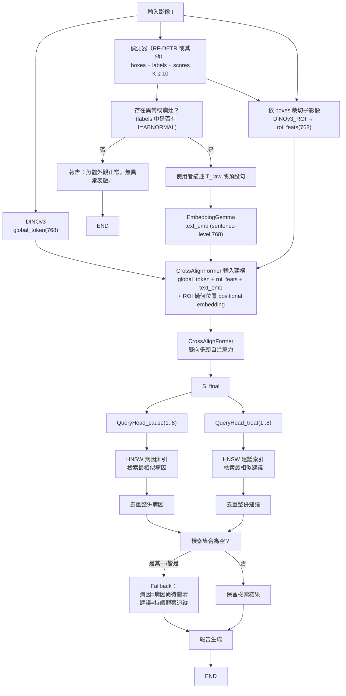
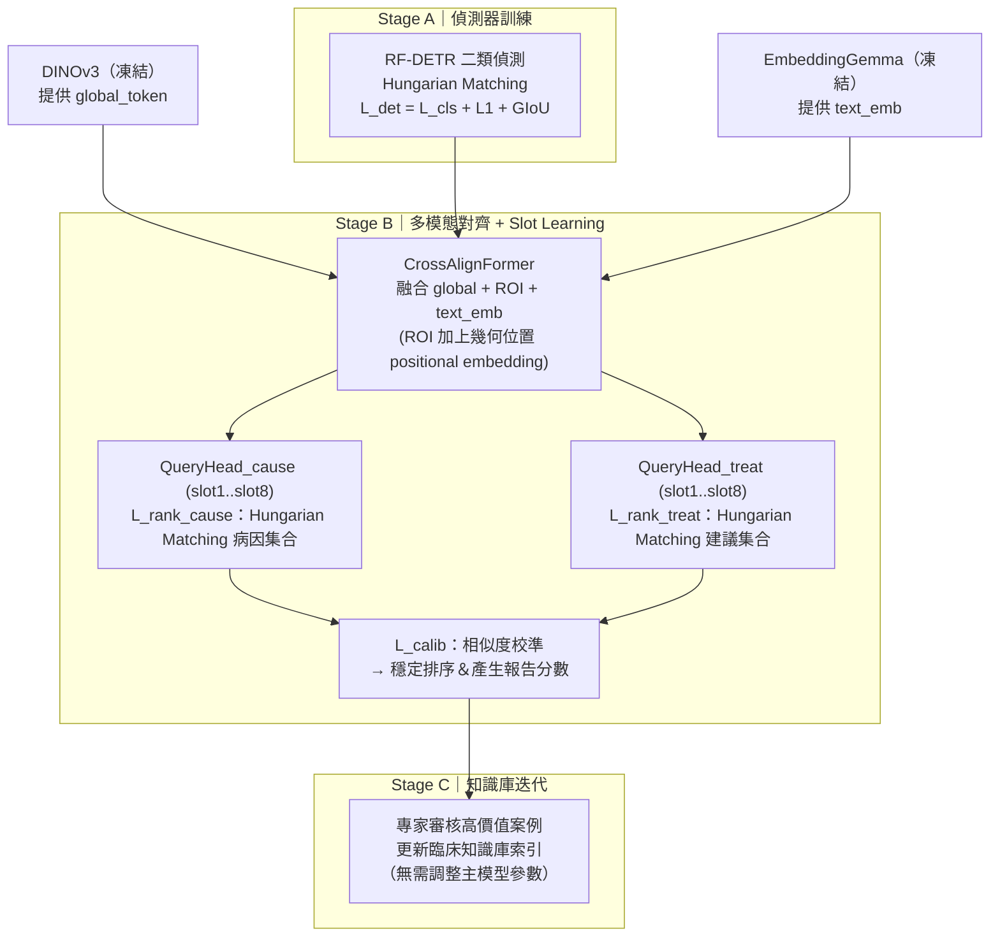

# 目標與輸出

* **輸入**

  * 單張魚體相關影像（可能是整隻魚或局部特寫）
  * 使用者的文字描述 `T_raw`
  * 若使用者未提供文字描述，系統自動注入預設文本：「魚體外觀異常，似乎生病了。」
    → 確保推論階段模型仍能取得文字語意訊息

* **中介表示**

  * 影像全域特徵（Vision Backbone：DINOv3，全域 token）
  * 病灶偵測框（Object Detection：RF-DETR，兩類：HEALTHY / ABNORMAL，輸出每個框的座標、類別與分數）
  * ROI 視覺特徵（DINOv3：以偵測框在原圖上裁切出子影像，分別送入 DINOv3 取得每個 ROI 的 768 維特徵）
  * 文字語意 token 序列（Text Encoder：EmbeddingGemma，以 token-level 768 維向量）

* **核心匯流**：CrossAlignFormer 多模態對齊模組（以下簡稱 **CrossAlignFormer**）

* **輸出**

  1. 病灶偵測結果

     * 每個偵測框（影像中疑似魚體或病灶的區域）
     * 偵測分數
     * 類別（HEALTHY / ABNORMAL）

  2. 病徵原因（集合）

     * 由模型產生的病因槽位向量檢索知識庫後，整併得到的病因候選清單
     * 每項附相似度分數
     * 若多個槽位檢索到同一病因，僅保留一份（取最高相似度）

  3. 處置建議（集合）

     * 由模型產生的處置槽位向量檢索知識庫後，整併得到的建議行動清單
     * 每項附相似度分數
     * 若多個槽位檢索到同一建議行動，僅保留一份（取最高相似度）
     * 每個建議行動也會帶安全備註（例如「需隔離」、「需符合法規」、「僅限重症」等），這些資訊是知識庫條目的 meta，不是模型自由生成

* **關鍵特性**

  * 檢索式（retrieval-based）決策，避免幻覺
  * 知識庫可替換成各地版本（法規/操作差異可本地化）
  * 多槽位（多病因、多建議）輸出，不假設只有單一診斷
  * 報告定位是「決策輔助草稿」，不是直接開立處置處方

---

## 系統總覽

```text
[影像 I]
   ├─► DINOv3(I) ─► global_token
   └─► Detector(I) ─► {boxes, labels, scores}

[影像 I + boxes]
   └─► DINOv3_ROI(I, boxes) ─► roi_feats[ ]  # 對每個框裁切 → DINOv3 → 768 維特徵

[文字 T_raw 或預設句]
   └─► EmbeddingGemma(...) ─► text_emb (sentence-level, 768)

[global_token + roi_feats[] + text_emb]
   └─► CrossAlignFormer
          ├─ 病徵原因槽位向量 {q_cause[1..8]}
          └─ 處置建議槽位向量 {q_treat[1..8]}

知識庫（EmbeddingGemma 空間，768 維）
  ├─ 病徵原因索引（HNSW CAUSE_INDEX）
  └─ 處置建議索引（HNSW TREAT_INDEX）

HNSW 檢索
  ├─ 對每個 q_cause[i] 檢索最相似病因
  └─ 對每個 q_treat[i] 檢索最相似建議行動

去重整併
  ├─ 若多個槽位檢索到同一病因 → 合併
  └─ 若多個槽位檢索到同一建議行動 → 合併
  （並保留最高相似度資訊）

► 報告輸出：
   - 偵測框/分數/類別
   - 病因集合（含相似度分數）
   - 處置建議集合（含相似度分數與安全備註）
   - 知識來源版本
   - 「本報告僅作為決策輔助草稿」
```

---

## 模組拆解與介面

### 1) 視覺基礎模型：DINOv3（魚病影像）

* 功能
  從輸入影像抽取全域視覺語境（不假設一定拍到整隻魚）。

* 產出

  * `global_token ∈ ℝ^768`：描述整體外觀/狀態（全身腫脹、消瘦、鱗片豎立等整體線索）

* 介面

  ```text
  image -> {global_token}
  ```

* 訓練策略
  DINOv3 **凍結**使用，不微調；在所有訓練/推論階段皆不更新其權重。

---

### 2) 病灶偵測：RF-DETR（魚病病灶）

* 模型行為

  * 以輸入影像 `I` 為輸入，使用 RF-DETR **自身 backbone** 提取特徵並進行物件偵測（DETR-style transformer decoder）。
  * 使用 Hungarian matching，並以分類 / 邊框迴歸 / GIoU 損失訓練。
  * 實作上目前使用 RF-DETR，但介面僅依賴 `boxes / labels / scores`，未來可替換為任意二類（HEALTHY / ABNORMAL）偵測模型，只要遵守同樣輸出格式。

* 分類標籤（兩類）

  1. `HEALTHY`
     局部與全身皆未見明顯異常
  2. `ABNORMAL`
     疑似異常區域

  設計重點：模型回答「哪裡有異常」，而不是直接預測病名，強調泛化力。

* 介面

  ```text
  image -> {
    boxes[K,4],                # K ≤ 10 (推論只保留 top-K=10)，格式為 [x1,y1,x2,y2]
    labels[K],                 # 每個框的整數類別 ID：0=HEALTHY, 1=ABNORMAL
    scores[K]                  # 偵測置信度（例如 softmax 後的最大類別機率）
  }
  ```

* ROI token 設計

  * 對於每一個偵測框 `boxes[i]`，在原始影像上裁切出子影像 `crop_i`，並縮放到
    DINOv3 的標準輸入尺寸後，送入同一個 DINOv3 backbone：
    ```text
    crop_i -> DINOv3(crop_i) -> roi_feats[i] ∈ ℝ^768
    ```
  * 也就是說，`roi_feats[i]` 是「以該偵測框為視野的 DINOv3 global token」。這樣可以讓 ROI 特徵與全域 `global_token` 共享同一個表徵空間，並且讓偵測器完全可替換（只要輸出 boxes / labels / scores 即可）。
  * 幾何位置所需的歸一化座標（以偵測器推論時的標準輸入尺寸為基準）在偵測階段一併輸出，供後續 CrossAlignFormer 使用。CrossAlignFormer 會將這些座標轉成 positional embedding 並加到 `roi_feats[i]`。

* 推論

  依 RF-DETR 分類分數排序與門檻，保留前 K=10 個偵測框。
  `roi_feats[i]` 會後續送進 CrossAlignFormer。

---

### 3) 文本編碼：EmbeddingGemma（症狀敘述）

* 功能
  將使用者提供的觀察描述文字轉換為高品質、多語言的向量以便進行語意搜尋與檢索增強生成。

* 文字來源

  * `overall.colloquial_zh`：資料集的中文通俗描述
  * `T_raw`：使用者填的描述
  * 預設句：「魚體外觀異常，似乎生病了。」
  * 備註：若偵測器在推論階段判定整體為健康（偵測結果沒有任何 `ABNORMAL` 類別），系統會直接輸出「魚體外觀正常，無異常表徵。」並跳過病因/建議檢索。

* 訓練階段 vs 推論階段

  * **訓練階段**：使用 `overall.colloquial_zh` 或預設句
  * **推論階段**：使用 `T_raw` 或預設句

* 介面

  ```text
  text -> { text_emb ∈ ℝ^768 }  # sentence-level 單一向量
  ```

* EmbeddingGemma **凍結**，並同時作為：

  * 病例文字（症狀敘述）嵌入空間
  * 病因/建議知識庫的檢索空間

---

### 4) CrossAlignFormer（多模態對齊）

**目的**
將三個來源整合進單一序列表示，並產生可檢索的病因槽位與建議槽位：

1. 全域影像語境：`global_token`（DINOv3）
2. 病灶區域表徵：`roi_feats[i]`（來自 DINOv3 對偵測框裁切影像的 global token，並加上幾何位置 positional embedding）
3. 文字語意：`text_tokens[j]`（EmbeddingGemma 的 token-level 向量序列，本文中簡化為 sentence-level `text_emb`）

**步驟**

1. **投影與拼接**

   * 本系統各模態向量皆為 `d = 768`：
     `global_token ∈ ℝ^768`、`roi_feats[i] ∈ ℝ^768`、`text_emb ∈ ℝ^768`，
     因此**無需額外線性投影**即可對齊至共同維度。
   * 在 **CrossAlignFormer 的輸入建構時**，一次性加入：

     * ROI 幾何位置 positional embedding
       （由 bounding box 歸一化座標經過小型 MLP 模組得到）
   * 定義：

     ```text
     G      = global_token                     # ℝ^768
     R[i]   = roi_feats[i] + pos_box(boxes[i]) # ℝ^768
     T_sent = text_emb                         # ℝ^768
     ```
   * 得到序列：

     ```text
     S_init = [G; R[1..K]; T_sent]  # 長度 L = 1 + K + 1
     ```

2. **雙向多頭自注意力（Bidirectional MHSA）**

   * 使用全注意力（無 causal mask）
   * 允許任意 token（ROI / global / text）彼此關注，蒐集上下文

3. **Transformer Block 結構**

   * 每層包含：

     * LayerNorm → MHSA → 殘差
     * LayerNorm → FFN（可用 SwiGLU）→ 殘差
   * 疊 n 層後輸出：

   ```text
   S_final ∈ ℝ^(L × 768)
   ```

4. **病徵原因槽位 `{q_cause[i]}`**

   * 準備 Nc=8 個可學習查詢 token：

     ```text
     Q_cause_1_init, ..., Q_cause_8_init
     ```

   * 這些查詢 token 對 `S_final` 做 cross-attention 匯聚，產生：

     ```text
     q_cause[i] ∈ ℝ^768,  i = 1..8
     ```

   * 每個 `q_cause[i]` 對應「本案例的一個潛在病因假說」。

   * 在訓練時，使用匈牙利匹配（bipartite matching）將這 8 個槽位與專家標註的病因集合元素一一對齊，並用對比式損失把正配對拉近（L_rank_cause）。

   * 若實際標註病因數量小於 8，剩餘未配對的槽位會對到一個 dummy/背景類別，並透過 margin-based push-away 要求它不要誤靠近任何已知病因，而不是懲罰成「錯誤病因」。

5. **處置建議槽位 `{q_treat[i]}`**

   * 準備 Nt=8 個可學習查詢 token：

     ```text
     Q_treat_1_init, ..., Q_treat_8_init
     ```
   * 同樣以 cross-attention 匯聚 `S_final`，產生：

     ```text
     q_treat[i] ∈ ℝ^768,  i = 1..8
     ```
   * `{q_treat[i]}` 代表「本案例的一個潛在建議行動」。
   * 訓練流程與病因相同，使用匈牙利匹配 + 對比式損失（L_rank_treat）。同樣有 dummy/背景槽位處理。

**介面總結**

```text
{global_token, roi_feats[], text_emb} 
   -> CrossAlignFormer 
   -> {
        q_cause[1..8],   # 每個 ∈ ℝ^768
        q_treat[1..8]    # 每個 ∈ ℝ^768
      }
```

**特性**

* ROI tokens 與文字 tokens 仍在同一 Transformer 序列中交互注意力，CrossAlignFormer 可以從影像中各個區域與文字描述的關係推得病灶分佈與嚴重程度，並彙整到 q_cause / q_treat。
* 多槽位輸出（Nc=8、Nt=8）代表集合，而非單一線性結論。

---

### 5) 檢索（HNSW ANN）

* 我們維護兩個向量索引，皆在 EmbeddingGemma 的 768 維空間中（EmbeddingGemma 凍結）：

  1. **病徵原因索引（CAUSE_INDEX）**

     * 條目為「疾病機制 / 疑似病因」的標準化描述
       例如：「嚴重細菌性感染導致全身性敗血」、「腎臟機能衰竭造成腹水與立鱗」、「水質惡化導致免疫崩潰與二次感染」
     * 每條目會存「病原類別（細菌/病毒/寄生蟲/環境/器官衰竭）」、「典型外觀線索」、「適用魚種/體型/生長階段」、「版本資訊」、「同義詞/口語對應」等 meta
     * 每條目向量：EmbeddingGemma(該條目文字描述) → `e_c^k ∈ ℝ^768`

  2. **處置建議索引（TREAT_INDEX）**

     * 條目為「單一建議行動」
       例如：「隔離病魚」、「檢測並改善水質」、「1–3 g/L 瀉鹽浴」、「廣效性抗生素藥浴/藥餌（符合法規前提）」、「重症末期人道處理」
     * 每條目 meta：劑量/濃度、適用條件、禁忌、法規需求、是否僅限重症
     * 向量：EmbeddingGemma(該建議行動文字) → `e_t^k ∈ ℝ^768`

* 推論時流程：

  * 對每個病因槽位向量 `q_cause[i]`，在 CAUSE_INDEX 上做最近鄰搜尋（HNSW ANN），取最相似候選（可取 top-1 或 top-K，再由系統決定保留策略）。
  * 對每個建議槽位向量 `q_treat[i]`，在 TREAT_INDEX 上做最近鄰搜尋，取最相似候選。
  * 蒐集所有檢索結果，並記錄相似度分數（例如 cosine-based，經 L_calib 校準成可比較的分數）。

* 去重整併：

  * 若多個槽位檢索到同一病因條目，只保留一份，並保留其最高分相似度。
  * 若多個槽位檢索到同一建議行動條目，只保留一份，並保留其最高分相似度。

* 本系統的知識庫 CAUSE_INDEX / TREAT_INDEX 由台灣水產臨床專家與獸醫審核並維護，因此內容符合台灣現行法規與實務操作。部署到其他地區時，只需要替換這兩個索引（含文字描述與合法建議行動清單），不需要重新訓練整個模型本體。

---

### 6) 建議整併與輸出

* 經過去重整併後，我們得到：

  * 病因候選集合（每個病因含描述文字與相似度分數）
  * 建議行動候選集合（每個建議含描述文字、相似度分數、以及安全/法規備註）

* 去重規則：

  * 如果多個槽位檢索到同一病因條目，只保留一份，並保留最高相似度分數。
  * 如果多個槽位檢索到同一處置條目，只保留一份，並保留最高相似度分數。

* 空集合處理與健康早退：

  * 若偵測器的偵測結果中沒有任何 `ABNORMAL` 類別，系統會直接走健康路徑並產生簡化報告，而不進行後續的病因/建議檢索流程。此時的文字輸出為：「魚體外觀正常，無異常表徵。」
  * 若已進入檢索流程，但檢索後 **病因候選集合為空**，則回傳預設病因條目：「病因尚待釐清」。
  * 若已進入檢索流程，但檢索後 **建議行動候選集合為空**，則回傳預設建議條目：「持續觀察追蹤」。

---

### 7) 報告生成器

* 報告內容包含：

  * 偵測框（座標、類別、偵測分數）

    * 類別為 HEALTHY / ABNORMAL
    * 用來標示「哪裡看起來異常」

  * 病因候選集合

    * 每個病因的標準化描述文字（來自知識庫）
    * 相似度分數（經 L_calib 校準的排序分數）
    * 可附該病因典型的外觀線索摘要（知識庫 meta）

  * 處置建議候選集合

    * 每個建議行動的標準化描述文字（來自知識庫）
    * 相似度分數（經 L_calib 校準的排序分數）
    * 安全/條件備註（知識庫 meta）

  * 知識來源版本

  * 報告定位說明

  * 輸出形式：

    * 結構化 JSON
    * 人類可讀報告（可含病灶框疊圖、病因卡片、建議行動卡片、注意事項）

  * JSON 結構化輸出範例

    以下為推論階段的最小結構化輸出格式示意，前端與後端可依此作為介面 contract：

    ```json
    {
      "detections": [
        {
          "bbox": [x1, y1, x2, y2],
          "class": "ABNORMAL",
          "score": 0.91
        },
        {
          "bbox": [x1, y1, x2, y2],
          "class": "ABNORMAL",
          "score": 0.87
        }
      ],
      "causes": [
        {
          "cause_id": "CAUSE_ascites_bacterial_sepsis_v2025_10_TW",
          "desc": "嚴重細菌性感染導致全身性敗血",
          "similarity": 0.82
        }
      ],
      "actions": [
        {
          "action_id": "TREAT_isolate_and_salt_bath_v2025_10_TW",
          "desc": "隔離病魚並進行 1–3 g/L 瀉鹽浴",
          "similarity": 0.79,
          "safety_note": "僅限重症個體；需符合法規"
        }
      ],
      "knowledge_base_version": "v2025-10-TW",
      "disclaimer": "本系統提供之病因與建議結果僅供決策參考，非自動處方。最終處置應由具備專業資格之人員，依現場情況與相關法規判斷。"
    }
    ```

    * `score` 為偵測器偵測置信度（來自分類頭 softmax）。
    * `similarity` 為經由 L_calib 校準後的檢索相似度分數，用於排序顯示。
    * `knowledge_base_version` 會對應目前載入的 CAUSE_INDEX / TREAT_INDEX 版本。

---

## 推論路徑

```python
# inputs: image I, text T_raw
T = T_raw if T_raw else "魚體外觀異常，似乎生病了。"

# 1. 視覺特徵與偵測
global_token = DINOv3(I)                           # ℝ^768（凍結）
boxes, labels, scores = Detector(I)                # 只依賴可替換偵測器的標準輸出
                                                   # labels: 0=HEALTHY, 1=ABNORMAL
has_abnormal = any(l == 1 for l in labels)

# 1.1 健康早退
if not has_abnormal:
    report = render_report(
        boxes=boxes,
        scores=scores,
        labels=labels,
        causes=[],   # 不進入檢索
        recommended_actions=[],
        provenance=knowledge_version_info(),
        healthy_text="魚體外觀正常，無異常表徵。"
    )
    return report

# 1.2 ROI 視覺特徵：裁切子影像 → DINOv3 global token
roi_feats = []
for bbox in boxes:
    crop = crop_and_resize(I, bbox)           # 依偵測框裁切原圖，縮放到 DINOv3 輸入尺寸
    feat = DINOv3(crop)                       # 取得該 ROI 的 global_token，形狀 ℝ^768
    roi_feats.append(feat)

# 2. 文字編碼（sentence-level）
text_emb = EmbeddingGemma.encode_sentence(T)       # ℝ^768（凍結）

# 3. 多模態對齊 (CrossAlignFormer) — 於此附加 ROI 幾何位置 positional embedding
S_init  = build_sequence_with_positional_embeddings(
    global_token, roi_feats, boxes, text_emb
)
S_final = CrossAlignFormer(S_init)

# 4. 病因槽位 / 建議槽位
q_cause_slots = QueryHead_cause(S_final)   # -> {q_cause[1..8]} ⊂ ℝ^768
q_treat_slots = QueryHead_treat(S_final)   # -> {q_treat[1..8]} ⊂ ℝ^768

# 5. 檢索與相似度
cause_candidates = []
for i in range(8):
    cause_candidates += HNSW_search(CAUSE_INDEX, q_cause_slots[i], K=1)

treat_candidates = []
for i in range(8):
    treat_candidates += HNSW_search(TREAT_INDEX, q_treat_slots[i], K=1)

# 6. 去重整併
causes_dedup = deduplicate_and_keep_best_similarity(cause_candidates)
actions_dedup = deduplicate_and_keep_best_similarity(treat_candidates)

# 6.1 空集合 fallback（僅在已確認存在異常時啟用）
if len(causes_dedup) == 0:
    causes_dedup = [{"desc": "病因尚待釐清", "similarity": 0.0}]
if len(actions_dedup) == 0:
    actions_dedup = [{"desc": "持續觀察追蹤", "similarity": 0.0}]

# 7. 報告組裝
report = render_report(
    boxes=boxes,
    scores=scores,
    labels=labels,
    causes=causes_dedup,
    recommended_actions=actions_dedup,
    provenance=knowledge_version_info()
)
return report
```

---

## 訓練策略

**Stage A：偵測器訓練**

1. 使用專家標註框與弱標註訓練 RF-DETR（或其他二類偵測器）。
2. 偵測器的二類標籤：

   * `HEALTHY`
   * `ABNORMAL`
3. 使用 `L_det`（分類 + 邊框 L1 + GIoU + Hungarian matching）訓練，確保模型能抓到各種異常區域，並提供可靠的 `boxes / labels / scores`。
4. DINOv3 與 EmbeddingGemma 在所有階段均為 **凍結**。

**Stage B：多模態對齊與檢索槽位學習**

1. EmbeddingGemma（768 維）作為固定語意座標系（**凍結**）。

   * 訓練時使用 `overall.colloquial_zh` 或預設句。
   * 推論時使用 `T_raw` 或預設句。

2. CrossAlignFormer 融合：

   * 全域 `global_token`（DINOv3 對整張影像）
   * ROI 視覺特徵 `roi_feats`（DINOv3 對偵測框裁切影像的 global token，並加上由 bounding box 產生的幾何位置 positional embedding）
   * 文字向量 `text_emb`

3. QueryHead_cause 產生 Nc=8 個病因槽位向量 `{q_cause[i]}`，QueryHead_treat 產生 Nt=8 個建議槽位向量 `{q_treat[i]}`。

4. `L_rank_cause`

   * 將該病例的標註病因清單編碼成 `{E_cause_gt[j]}`（EmbeddingGemma）。
   * 匈牙利匹配 `{q_cause[i]}` ↔ `{E_cause_gt[j]}`，用對比式損失拉近正配對。
   * 未對齊槽位走 dummy/背景 + margin-based push-away。

5. `L_rank_treat`

   * 將建議行動標註清單編碼成 `{E_treat_gt[j]}`（EmbeddingGemma）。
   * 匈牙利匹配 `{q_treat[i]}` ↔ `{E_treat_gt[j]}`，對比式損失訓練。
   * 未對齊槽位同樣走 dummy/背景策略。

6. `L_calib`

   * 輔助校準，使與知識庫條目的 cosine 相似度對應到穩定可比較的排序分數。

**Stage C：知識庫迭代**

* 高價值 / 高風險案例（例如全身性腫脹＋多處潰瘍）由專家回顧並修正：

  * 病因集合標註
  * 處置集合標註
  * 建議行動的安全備註（如「僅限重症」、「需隔離」、「需符合法規」）

* 修正內容直接更新至 HNSW 索引（CAUSE_INDEX / TREAT_INDEX），即可改善檢索品質，而不必調整主模型參數。

---

## 損失函數摘要

```text
L_total
  = λ1 * L_det
  + λ2 * L_rank_cause
  + λ3 * L_rank_treat
  + λ4 * L_calib
```

* `L_det`：偵測損失（RF-DETR）：分類 + 邊框 L1 + GIoU + Hungarian matching
* `L_rank_cause`：病因槽位集合的檢索式對比損失（匈牙利匹配，忽略順序；dummy/背景處理）
* `L_rank_treat`：建議行動槽位集合的檢索式對比損失（匈牙利匹配；dummy/背景處理）
* `L_calib`：相似度值的排序校準（sim_score）

---

## 部署與工程

* **模型組成**

  * 視覺主幹：DINOv3（凍結；提供 `global_token`）

  * 偵測器：RF-DETR（以自身 backbone 處理輸入影像，可替換）

    * 二類偵測（HEALTHY / ABNORMAL）
    * 產出偵測框 / 分數 / 類別標籤（labels: 0=HEALTHY, 1=ABNORMAL）
    * 介面只依賴 `image -> {boxes, labels, scores}`，可替換為其他偵測模型

  * ROI 編碼器：DINOv3_ROI

    * 對每個偵測框在原圖上裁切出子影像，縮放到 DINOv3 標準輸入尺寸
    * 使用與全域路徑相同的 DINOv3（凍結）取得該 ROI 的 global token 作為 `roi_feats[i] ∈ ℝ^768`

  * 多模態對齊：CrossAlignFormer

    * 融合 global_token、ROI tokens（含幾何位置 positional embedding）、文字 tokens
    * 輸出 `{q_cause[1..8]}` 與 `{q_treat[1..8]}`

  * 檢索：HNSW

    * 病徵原因索引（CAUSE_INDEX）
    * 處置建議索引（TREAT_INDEX）
    * 索引內容由台灣水產臨床專家/獸醫審核，符合法規與實務
    * 可被替換成其他地區的版本，不需重訓主模型

  * 報告生成：

    * 整合偵測框
    * 病因候選集合（含相似度）
    * 建議行動候選集合（含相似度與安全/法規備註）
    * 知識庫版本
    * 宣告「本報告為決策輔助草稿」

* **效能假設 / 延遲**

  * 推論全部在 GPU 上執行

  * 偵測器依分數排序後保留 top-K=10 個 ROI

  * CrossAlignFormer 的輸入序列長度約為：

    * 1 個 global token
    * 最多 10 個 ROI tokens
    * 1 個 sentence token
      → 總長度為 `L = 1 + K + 1`，可配合高效注意力 kernel（如 FlashAttention）以降低延遲與顯存佔用

  * HNSW 檢索可在同一伺服器側以 CPU/GPU 混合方式即時完成，因為 EmbeddingGemma 空間是固定 768 維，查詢量固定為 8+8 槽位

* **知識庫服務**

  * CAUSE_INDEX / TREAT_INDEX 為可熱更新的 HNSW 索引
  * 可隨時新增新的病因條目、建議條目、或修改安全備註／法規備註
  * 可在不同地區切換不同版本（例如 v2025-10-TW → v2025-10-JP），而不需調整 CrossAlignFormer 或 QueryHeads

* **可解釋性與責任界線**

  * 報告提供「哪裡有病灶（偵測框）」、「可能的病因清單」與「可能的建議行動清單」
  * 報告本身標示為「決策輔助草稿」，特別是對藥物/侵入性處置（廣效抗生素、人道處理）的建議都會附上「需符合法規」、「僅限重症」等安全備註，並交由合格人員判斷後續實施

---

## Mermaid 流程圖（推論）



---

## Mermaid 流程圖（訓練）

